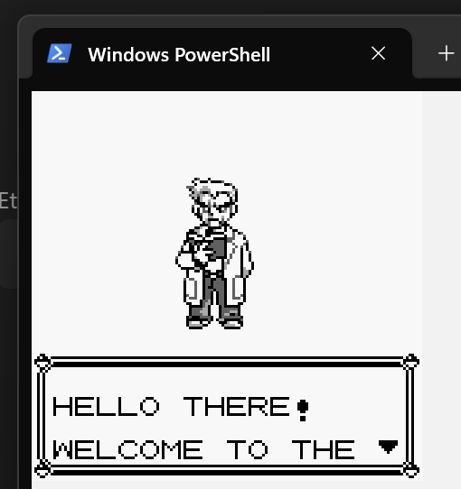
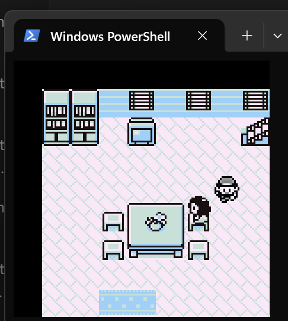
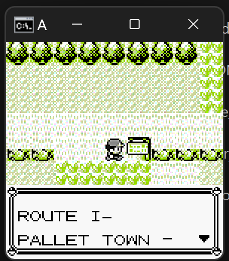
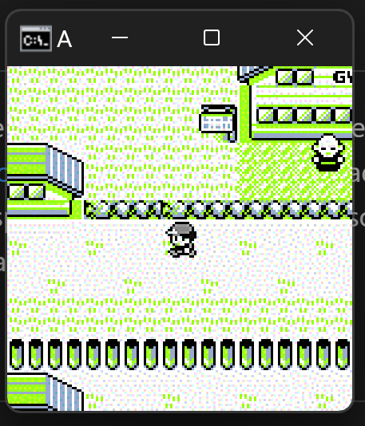
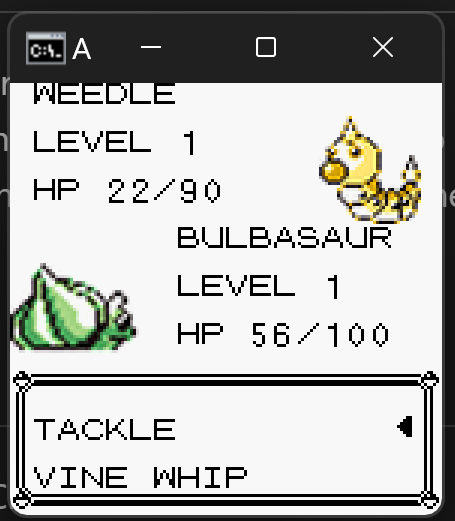
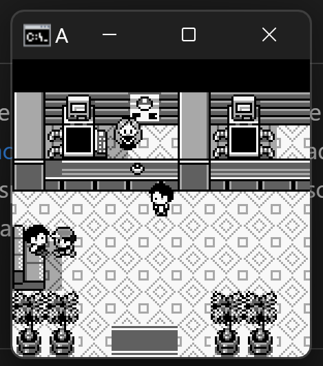

# Pseudomon

This is an old project from early 2020 I found on a USB. I haven't changed a single line, but I added this readme (and the screenshots) because I didn't document the project very well! The original readme is available at [README_legacy.md](README_legacy.md). I encourage you to read it rather than this, because I think 15yo me was a better programmer than I am now, and I am obliged to request it out of respect for him. There are also some gems in that readme haha.

## Overview

Welcome to **Pseudomon**, a Pokémon variant inspired by Pokémon Red, with the aim of allowing you to explore the world of Pokémon right from your command line! Catch, train, and battle your favourite Pokémon as you embark on an exciting journey. The game's main selling point is its use of graphics in the command line to look visually similar to Pokémon Red.


## Gameplay

That line above might have escaped your attention so let me *show* you what I mean by graphics in command line. It's not ASCII art... You can see all of these screens yourself in just the first 2 minutes of gameplay, and there's so much to explore!




<br>




## In-Game Features

- **Dialogue**: Speak to the NPCs and read signs!
- **Battle System**: Engage in turn-based battles against wild Pokémon and trainers.
- **Explore**: Discover different areas, each with unique Pokémon to catch.
- **Healing**: Heal Pokémon in Pokémon centres.
- **Pokémart**: Purchase Pokéballs and potions.
- **Catch Pokémon**: I don't remember implementing this, but the readme says you can throw Pokéballs, and how else would you catch Pokémon?

## Meta Features

- **Music**: Original 8-bit music
- **Realistic**: Aims to be as close to the original in terms of graphics and exploration mechanics. Some differences in gameplay though, which you can discover on your own.
- **State**: Save your state at assigned save state "computers", which you can find in the same location as in Pokémon Red.
- **Graphics**: Although this will run only in your command line with no additional windows, Pseuodmon features graphics faithful to the original Pokémon Red. How did I get graphics in the terminal? That is for you to find out by reading the source code :P
- **Entirely Procedural**: I did not know what a class was, or how to structure a project. The entire program is one monolithic script.

## Requirements

- Python 3.x
- And that's it! There are no external dependencies, everything from the graphics to the music is supported by Python.
- Note: I've only tested this on Windows 10 and 11, so it might not work properly on other OS.

## Installation

1. Clone the repository:
   ```bash
   git clone https://github.com/Mukundks2004/Pseudomon.git
   ```

2. Navigate to the project directory:
   ```bash
   cd Pseudomon
   ```

3. Run the game in terminal:
   ```bash
   python pseudomon.py
   ```

4. Wait for the game to load. It will take some time, and you will know it has worked once you hear the music. If *something* is showing up on the terminal but it is not super clear what, zoom out as far as you can go and press `Z` to start the game. It should start rendering the introduction cutscene on the zoomed-out screen properly.

## Gameplay Instructions

- **Into/Dialogue/Cutscene**: Press `Z` to forward through text.
- **Exploration**: Arrow keys for navigation.
    - `Z` to talk to people or read signs
    - `X` to save gamestate (saves Pokémon, location, xp and inventory)
    - `C` to load gamestate (loads Pokémon, location, xp and inventory)
    - `V` to read inventory (Note: I'm not sure what this means but it was in the original readme)
- **Battle**: Battles are triggered when in tall grass or through some other interaction with trainers I don't remember exactly what.
    - Up and Down keys to navigate attacks
    - `Z` key to read dialogue and confirm an attack
    - `X` key to throw a Pokéball
    - `C` to use a potion (did the original Pokémon even have potions??)
- **Help**: You're on your own.

## Contributing

Contributions are not welcome! If you have suggestions for improvements or new features, please keep them to yourself because this is has historical significance, it is one of the only surviving pieces of code from hs and I will not be changing it, aside from this readme and the accompanying SSs.

## Acknowledgments

- Inspired by Pokémon Red
- Special thanks to 15 yo me for building this without even knowing what a class was